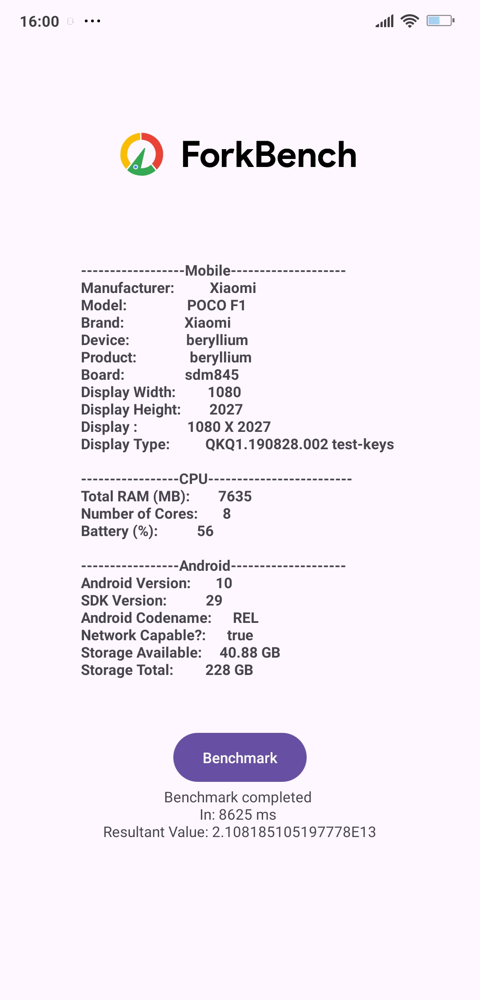
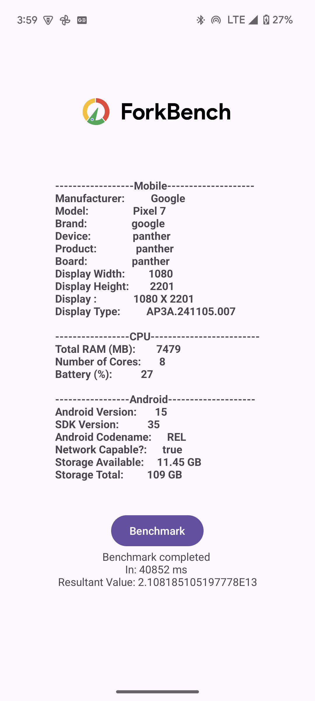
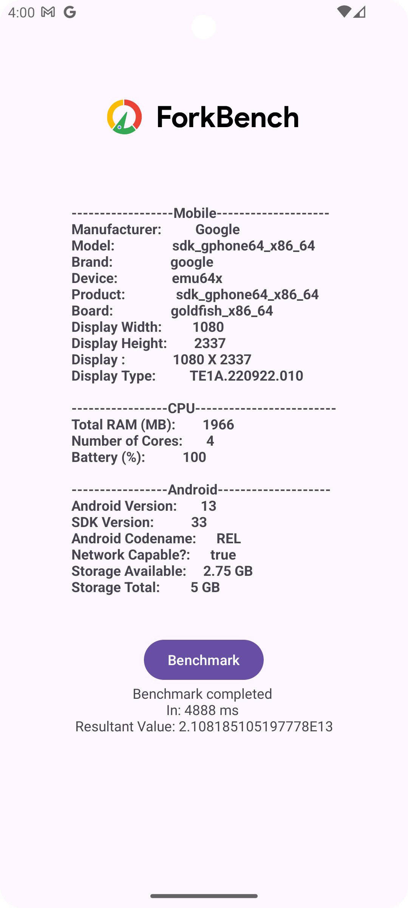

# ForkBench

System Information and Benchmark Tool for Windows

## Features: 
1. System information fetching.
2. Sensor Information
3. Benchmarking

## Phase - I 
This phase includes me making a barebones android application that can fetch required device information and also implement a basic benchmark to begin with.
The following are some screens from the ForkBench BareBones application

## Poco F1
  

## Google Pixel 7
  

## Google Pixel 7 - AVD Emulator
  

## Phase - II 
This phase includes revamping the UI/UX of the app and making it look supererbly asthethic and pleasing to the eye as well as the fluidity and ease of access would be improved along with increase in complexity of all that is happening with the app would increase and will add aditional features.

This Phase is ongoing.
